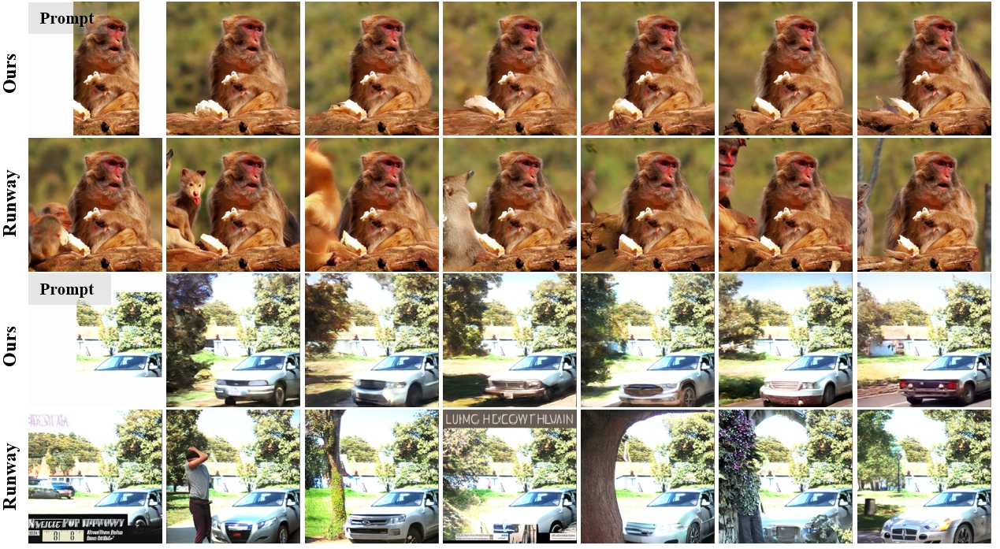

<br />
<p align="center">
  <h1 align="center">PrefPaint: Aligning Image Inpainting Diffusion Model with Human Preference </h1>

  <p align="center">
  Neurips 2024
    <br />
    <strong>Kendong Liu</strong>
    ·
    <a href="https://scholar.google.com/citations?user=d1L0KkoAAAAJ&hl=en"><strong>Zhiyu Zhu*</strong></a>
    ·
    <a href="https://www.chuanhao-li.com/"><strong>Chuanhao Li*</strong></a>
    ·
    <strong>Hui Liu</strong>
    ·
    <strong>Huanqiang Zeng</strong>
    ·
    <a href="https://sites.google.com/site/junhuihoushomepage/"><strong>Junhui Hou</strong></a>
    ·
  </p>

  <p align="center">
    <a href='http://arxiv.org/abs/2410.21966'></a>
    <a href='https://prefpaint.github.io/' style='padding-left: 0.5rem;'>
      </a>
    <a href='https://colab.research.google.com/drive/1QLKFp0hTe37tkSNhl0oVNVqtKgnAKOxX?usp=drive_link.' style='padding-left: 0.5rem;'></a>
  </p>

</p>
<br />

This repository contains the pytorch implementation for the paper [PrefPaint: Aligning Image Inpainting Diffusion Model with Human Preference](https://prefpaint.github.io/), Neurips 2024. 



## News
- [2024-12-16] Release a Colab notebook for inpainting results assessment [](https://colab.research.google.com/drive/1QLKFp0hTe37tkSNhl0oVNVqtKgnAKOxX?usp=drive_link.).
- [2024-12-16] Inpainting model and InpaintReward model Release.
- [2024-12-16] Reinforcement Learning Code Release.
- [2024-09-26] Our paper has been accpetd by Neurips 2024!

## Setup

### Cloning the Repository
Use the following command to clone:

```shell
git clone https://github.com/Kenkenzaii/PrefPaint.git
```

### Python Environment
To prepare the Python environment needed to run PhysGaussian, execute the following commands:
```shell
conda create -n prefpaint python=3.8
conda activate prefpaint

pip install -r requirements.txt
pip install clip@git+https://github.com/openai/CLIP.git

```
By default, We use pytorch=2.0.0+cu118.


## Usage
```bash

import os
from PIL import Image
from diffusers import AutoPipelineForInpainting

pipe = AutoPipelineForInpainting.from_pretrained(
             'kd5678/prefpaint-v1.0', cache_dir='/data/kendong/cache').to("cuda")

color_path = './examples/image.png'
mask_path = './example/mask.png'
os.makedirs('results', exist_ok=True)

image, mask = Image.open(color_path), Image.open(mask_path).convert('L')
# You can provide your prompt here.
prompt = ""
result = pipe(prompt=prompt, image=image, mask_image=mask, eta=1.0).images[0]            
result.save('./results/result.png')
  
```

## Training
If you want to train your inpainting model, please follow these steps:
1. Prepare Datasets. We will release our dataset soon.
2. Download the inpaint reward model.
```bash
import os
from huggingface_hub import hf_hub_download

def RewardModel_download(url: str, root: str):
    os.makedirs(root, exist_ok=True)
    filename = os.path.basename(url)
    download_target = os.path.join(root, filename)
    hf_hub_download(repo_id="kd5678/prefpaintReward", filename=filename, local_dir=root)
    return download_target

MODEL_NAME= 'https://huggingface.co/kd5678/prefpaintReward/blob/main/prefpaintReward.pt'

model_path = RewardModel_download(MODEL_NAME, './checkpoint')
```
3. Run "bash train.sh" or "accelerate launch train_inpainting_model.py".

## Testing
For testing performance of our inpainting model, you can upload your own input on <a href="https://huggingface.co/spaces/kd5678/prefpaint"></a>. A Colab notebook <a href='https://colab.research.google.com/drive/1QLKFp0hTe37tkSNhl0oVNVqtKgnAKOxX?usp=drive_link.' style='padding-left: 0.5rem;'></a> is also provided for a quick evaluation of the inpainted results.


## TODO

- [x] Release training code.
- [x] Release inpainting model and inpaint reward model.
- [ ] Config file guidelines.
- [ ] Release InpaintReward training code.
- [ ] Release Datasets.
- [ ] Add more pretrained models.

## Acknowledgement
Thanks for the following wonderful works: [Diffusers](https://huggingface.co/docs/diffusers/index), [ImageReward](https://github.com/THUDM/ImageReward)


## Citation

```
@article{liu2024prefpaint,
  title={PrefPaint: Aligning Image Inpainting Diffusion Model with Human Preference},
  author={Liu, Kendong and Zhu, Zhiyu and Li, Chuanhao and Liu, Hui and Zeng, Huanqiang and Hou, Junhui},
  journal={arXiv preprint arXiv:2410.21966},
  year={2024}
}
```